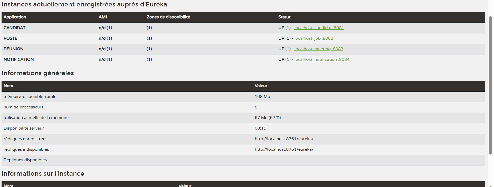

# TP Eureka – Découverte de microservices

Tous les microservices s'enregistrent auprès d'un même serveur **Netflix Eureka**. Ils se retrouvent ensuite par leur nom Eureka plutôt que par une adresse écrite en dur. Comme Eureka expose une API REST, des services écrits en Java, Node.js et Python peuvent tous s'y enregistrer.

## Membres de l'équipe

- Nom Prénom 1
- Nom Prénom 2
- Nom Prénom 3
- Nom Prénom 4

## Architecture

| Microservice  | Technologie               | Port par défaut | Nom dans Eureka | Dossier          |
|---------------|---------------------------|-----------------|-----------------|------------------|
| Eureka Server | Spring Boot               | 8761            | —               | `eureka-server/` |
| Candidat      | Spring Boot + H2          | 8081            | `CANDIDAT`      | `candidat/`      |
| Job           | Spring Boot + MySQL       | 8082            | `JOB`           | `job/`           |
| Meeting       | Node.js / Express         | 8083            | `MEETING`       | `meeting/`       |
| Notification  | Python / FastAPI          | 8084            | `NOTIFICATION`  | `notification/`  |

```
                    ┌──────────────────────┐
                    │   Eureka Server      │
                    │   localhost:8761     │
                    └──────────▲───────────┘
        register / heartbeat   │   (toutes les 30 s)
   ┌────────────┬──────────────┼──────────────┬────────────────┐
   │ CANDIDAT   │ JOB          │ MEETING      │ NOTIFICATION   │
   │ 8081, 8091 │ 8082         │ 8083, 8085   │ 8084, 8086     │
   └────────────┴──────────────┴──────────────┴────────────────┘
```

### Endpoints principaux

| Service      | Endpoint                                   | Description                                         |
|--------------|--------------------------------------------|-----------------------------------------------------|
| Meeting      | `GET /api/meetings/hello`                  | Hello                                               |
| Meeting      | `GET /health`                              | Santé (déclaré comme `healthCheckUrl` / `statusPageUrl`) |
| Meeting      | `GET /api/meetings/candidat/{id}`          | **Bonus** : découvre `CANDIDAT` via Eureka puis appelle `/api/candidates/{id}` |
| Notification | `GET /api/notifications/hello`             | Hello                                               |
| Notification | `GET /health`                              | Santé (déclaré comme `health_check_url` / `status_page_url`) |

## Prérequis

- Java 17 et Maven
- Node.js 18 ou plus récent (pour `fetch`)
- Python 3.10 ou plus récent
- MySQL ou MariaDB sur `localhost:3306` (utilisateur `root`, mot de passe vide). La base `jobdb` est créée automatiquement.

Installation des dépendances :

```bash
cd meeting && npm install
cd notification && pip install -r requirements.txt
```

## Ordre de démarrage

Lancer chaque commande dans un terminal séparé. Un service peut mettre jusqu'à 30 secondes à apparaître dans le dashboard.

1. **Eureka Server**
   ```bash
   cd eureka-server && mvn spring-boot:run
   ```
   Le dashboard est sur http://localhost:8761.
2. **Candidat** et **Job**
   ```bash
   cd candidat && mvn spring-boot:run
   cd job && mvn spring-boot:run
   ```
3. **Meeting** et **Notification**
   ```bash
   cd meeting && npm start
   cd notification && python -m uvicorn main:app --port 8084
   ```

## Lancer plusieurs instances

Chaque instance doit avoir un port différent.

| Service      | 2ᵉ instance                                                                 |
|--------------|-----------------------------------------------------------------------------|
| Candidat     | `mvn spring-boot:run -Dspring-boot.run.arguments=--server.port=8091`. Avec IntelliJ, ajouter la VM option `-Dserver.port=8091`. |
| Meeting      | `PORT=8085 node index.js` (PowerShell : `$env:PORT=8085; node index.js`)     |
| Notification | `PORT=8086 python -m uvicorn main:app --port 8086` (PowerShell : `$env:PORT=8086; python -m uvicorn main:app --port 8086`) |

> ⚠️ Pour Notification, la variable `PORT` et l'option `--port` d'Uvicorn doivent avoir **la même valeur**. Sinon, Eureka annonce un port sur lequel le service n'écoute pas.

Candidat utilise une base H2 en mémoire : chaque instance a donc ses propres données.

## Vérification

```bash
# Registre complet (JSON)
curl -H "Accept: application/json" http://localhost:8761/eureka/apps

curl http://localhost:8083/api/meetings/hello
curl http://localhost:8084/api/notifications/hello
curl http://localhost:8083/health
curl http://localhost:8084/health
curl http://localhost:8083/api/meetings/candidat/1
```

À l'arrêt (Ctrl+C), Meeting et Notification se **désenregistrent immédiatement** d'Eureka : on n'attend pas le délai d'expiration de 90 s.

## Dashboard Eureka



Sur cette capture, on voit les 4 services `CANDIDAT`, `JOB`, `MEETING` et `NOTIFICATION` en même temps, ainsi que plusieurs instances sur des ports différents.
